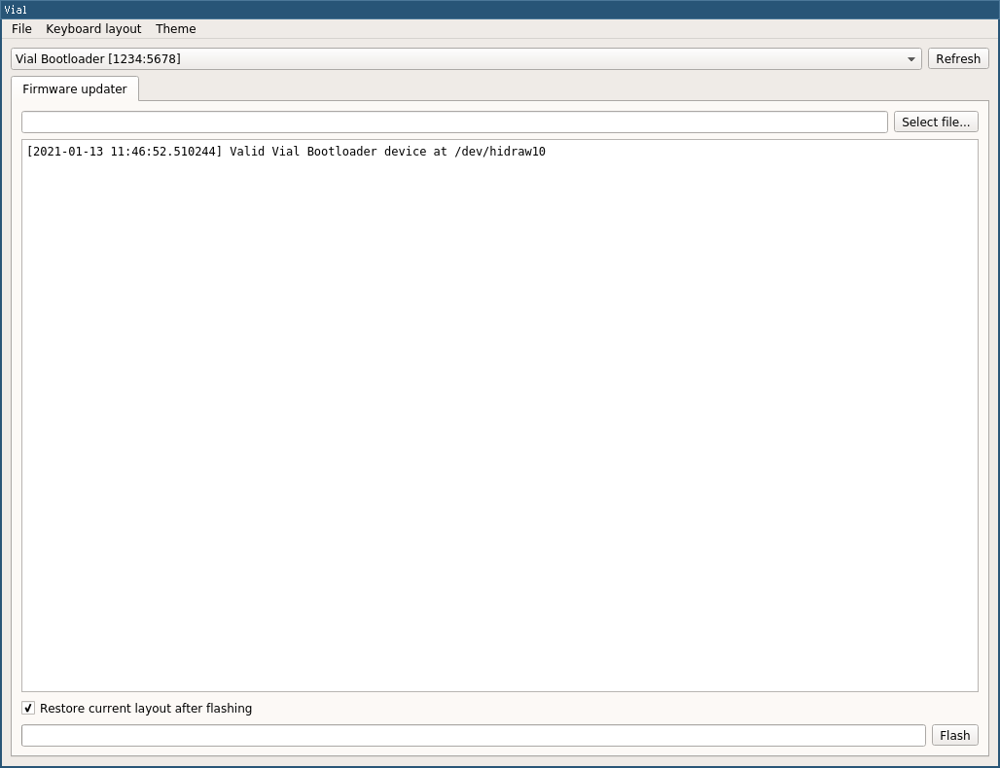
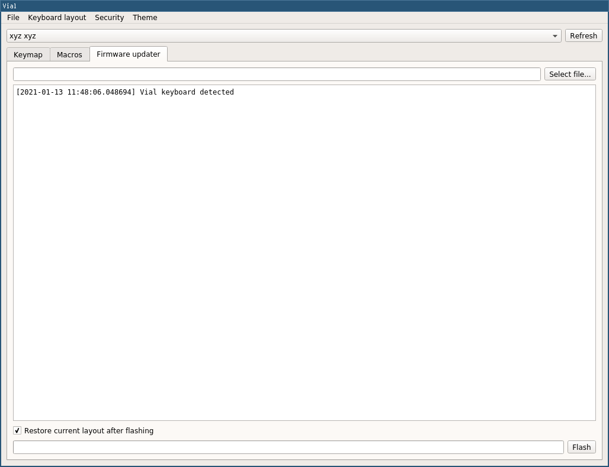

# vibl

vibl: a driverless keyboard bootloader that integrates with Vial GUI.

Currently, implementations are available for:
- STM32F103 (based on [bootsector/stm32-hid-bootloader](https://github.com/bootsector/stm32-hid-bootloader))

## Porting

### Porting the bootloader (STM32F103)

1. Add a new line in [CMakeLists.txt](https://github.com/xyzz/stm32f103-hid-keyboard-bootloader/blob/00ca0dc751dac3dc3b550f710ae2f4396702018e/bootloader/CMakeLists.txt#L65) for your keyboard, e.g. `add_bootloader(mykeyboard)`

2. Add a new option in the `bootloader/src/config.h` configuration file for your keyboard [before the final "else" statement](https://github.com/xyzz/stm32f103-hid-keyboard-bootloader/blob/00ca0dc751dac3dc3b550f710ae2f4396702018e/bootloader/src/config.h#L23):

```C
#elif defined(TARGET_MYKEYBOARD)
/*
  This should match the UID you have configured in the Vial firmware
  See Vial porting docs for more info: https://vial-kb.github.io/gettingStarted/porting-to-vial.html
*/
#define VIAL_KEYBOARD_UID {0xXX, 0xXX, 0xXX, 0xXX, 0xXX, 0xXX, 0xXX, 0xXX}
/*
  These configure an emergency key held to trigger bootloader entry on boot.
  See https://github.com/xyzz/stm32f103-keyboard-bootloader#adding-a-new-keyboard for an explanation.
*/
#define BL_OUTPUT_BANK GPIOB
#define BL_OUTPUT_PIN 12
#define BL_INPUT_BANK GPIOB
#define BL_INPUT_PIN 13
```

3. Compile the bootloader

```
cd bootloader
mkdir build && cd build
cmake ..
make
```

This should produce a `bootloader-mykeyboard.bin` file.

4. Flash and write-protect the bootloader

In order to program option bytes, you should use a [fork of stlink](https://github.com/xyzz/stlink/tree/stm32f10-opt-bytes). Once you compile it, flash the bootloader with:

```
st-flash opterase
st-flash write ../../misc/opt-head.bin 0x1FFFF800
st-flash write bootloader-mykeyboard.bin 0x8000000
st-flash write ../../misc/opt-tail.bin 0x1FFFF802
st-flash --area=option read
```

You should confirm that the final command produces the following output:

<pre>
A5 5A FF 00 FF 00 FF 00 <b>FE 01</b> FF 00 FF 00 FF 00
</pre>

`FE 01` indicates that the first block of 0x1000 bytes is write-protected.

Power-cycle the device and confirm it boots into the bootloader:

```
[1737747.221873] usb 1-5.2: new full-speed USB device number 8 using xhci_hcd
[1737747.468303] usb 1-5.2: New USB device found, idVendor=1234, idProduct=5678, bcdDevice= 0.01
[1737747.468306] usb 1-5.2: New USB device strings: Mfr=1, Product=1, SerialNumber=2
[1737747.468307] usb 1-5.2: Product: vibl-HIDUSB
[1737747.468308] usb 1-5.2: Manufacturer: vibl-HIDUSB
[1737747.468309] usb 1-5.2: SerialNumber: vibl:d4f8159c
```

### Integrating into vial-qmk

1. In your keyboard `rules.mk`, enable the `vibl` bootloader<sup>[(example)](https://github.com/vial-kb/vial-qmk/blob/3f0b421d6543867c3a53652471b86a51764fca6c/keyboards/vial_test/rules.mk#L2-L3)</sup>:

```
MCU = STM32F103
BOOTLOADER = vibl
```

2. In your `vial.json` file, enable the `vibl` feature<sup>[(example)](https://github.com/vial-kb/vial-qmk/blob/74012c5920558d9b73fc12aa315008beec33e3d9/keyboards/vial_test/keymaps/via/vial.json#L25-L27)</sup>:

```
  "vial": {
    "vibl": true
  }
```

3. Compile your keyboard firmware as usual with `make mykeyboard:via`; now the build process will produce a `.vfw` file in addition to the `.bin`:

<pre>

Compiling: quantum/via.c                                                                            [OK]
Compiling: tmk_core/common/command.c                                                                [OK]
Linking: .build/vial_test_via.elf                                                                   [OK]
Creating binary load file for flashing: .build/vial_test_via.bin                                    [OK]
--------------------------------------------------------------------------------
<b>Vial update package created at vial_test_via.vfw</b>
--------------------------------------------------------------------------------
Creating load file for flashing: .build/vial_test_via.hex                                           [OK]

Size after:
   text	   data	    bss	    dec	    hex	filename
      0	  30934	      0	  30934	   78d6	.build/vial_test_via.hex

Copying vial_test_via.bin to qmk_firmware folder                                                    [OK]
(Firmware size check does not yet support cortex-m3 microprocessors; skipping.)
</pre>

At that point you should be able to open Vial GUI, have the bootloader auto-detected and flash your firmware package. Further, after flashing such firmware for the first time, the update process can also be performed without having to manually restart in bootloader mode.

<table>
<tr>
<td>


Firmware updater when keyboard is in bootloader mode
</td>
<td>


Firmware updater when keyboard is running vial-qmk firmware
</td>
</tr>
</table>
